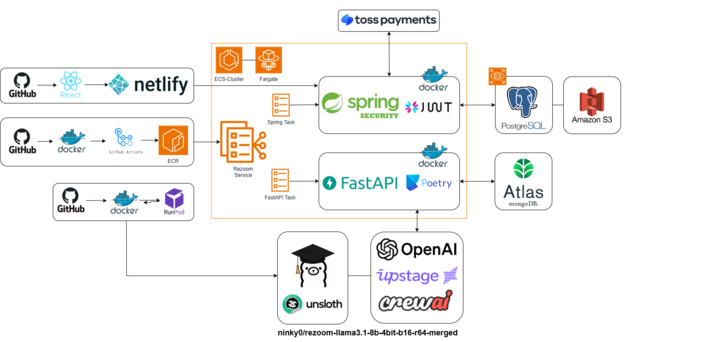

<h1>Rezoom</h1>

AI 기반 이력서-채용공고 매칭 및 코칭 서비스

---

## 프로젝트 개요

저희 프로젝트 **Rezoom**은 지원자의 이력서와 채용공고를 AI가 분석하여  **매칭 점수, 요약, 학습 로드맵, 자기소개서 피드백**을 제공하는  
**AI 기반 양방향 채용 매칭·코칭 플랫폼**입니다.
모델은 직접

### 주요 기능
- LLM 기반 이력서-채용공고 정밀 분석 및 매칭
- Multi-Agent 기반 피드백 & 로드맵 생성
- 프론트/백 분리 + 완전 MSA 구조 + ECS 자동 배포

---

## 시스템 아키텍처

| 영역             | 기술 구성                                                                                         |
|------------------|--------------------------------------------------------------------------------------------------|
| **Frontend**     | React                                                                                           |
| **Backend**      | Spring Boot (결제, 인증), FastAPI (AI 분석, DB 연동)                                              |
| **AI/LLM 모델**  | `LLaMA3 8B` (Unsloth LoRA fine-tuned) + CrewAI Agent + LangGraph GAN 구조                        |
| **데이터베이스** | PostgreSQL, MongoDB Atlas                                                                         |
| **스토리지**     | Amazon S3                                                                                        |
| **인프라**       | GitHub Actions → Docker → AWS ECR → ECS Fargate / RunPod 추론 서버                                |
| **기타 연동**    | Toss Payments, OpenAI API, Poetry, Wandb                                                         |

---

## 모델 상세

- **모델명**: `ninky0/rezoom-llama3.1-8b-4bit-b16-r64-merged`
- **기반**: Meta LLaMA 3.1 8B, 4-bit 양자화, b16 r64 구조
- **파인튜닝**: Unsloth + Alpaca SFT
- **배포 환경**: RunPod 워커 병렬 추론 → FastAPI 호출로 응답

---

## 화면

---

## 기술 스택

---

## 모델 저장소

[Hugging Face - ninky0/rezoom-llama3.1-8b-4bit-b16-r64-merged](https://huggingface.co/ninky0/rezoom-llama3.1-8b-4bit-b16-r64-merged)

---

본 프로젝트는 실무형 AI 채용 서비스를 위한  
엔드-투-엔드 아키텍처 구성 및 모델 추론 시스템을 구현하며 개발 역량을 강화하는 데 중점을 두었습니다.

